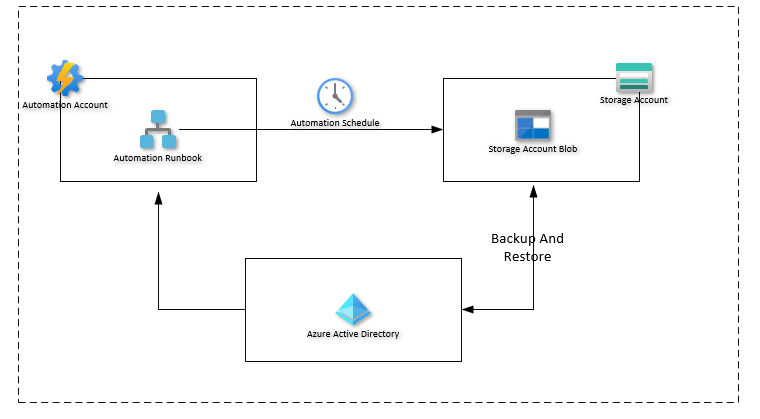

# azure-ad-recovery-manager

**azure-ad-recovery-manager** module is an opinionated solution for backup and restore of Azure Active Directory security groups. The module provides cmdlets to backup the users & security groups in a database file(SQLite) and it can then be uploaded to storage account or any kind of storage solution for backup.

## Recommended steps

The recommendation is to create a storage account with Geo-Replication enabled for storing the backup files and an automation account to create a runbook and schedule it.

- Runbook 1: **backup.ps1** - Schedule and point it to a storage account to run and store the backup files. (Schedule daily).
- Runbook 2: **restore.ps1** - This is on demand and can be edited before running the runbook. (On demand).

</br>



We can also run the **restore.ps1** locally and restore the deleted groups. For this to work successfully we should have a copy of database locally. If the database is stored in storage account then it has to be downloaded and saved in the current working directory (Note that the name of database should be **Azure-AD-Backup.db** and if you've time stamped the database in storage account, then it has to be renamed).

## Getting Started

Install the Module from [PowerShell Gallery](https://www.powershellgallery.com/packages/azure-ad-recovery-manager/1.0.0).

```pwsh
# To install the module for current logged in user, run -
C:\> Install-Module -Name azure-ad-recovery-manager -Scope CurrentUser -Repository PSGallery -Force
```

```pwsh
# To install the module for all users, run -
C:\> Install-Module -Name azure-ad-recovery-manager -Force

# Login to desired tenant
C:\> Connect-AzAccount -TenantId 'xxxxxxxxxxxxxxxxxxxx'
```

## Run it locally

Please download the script `backup.ps1` from [scripts](https://github.com/hkarthik7/azure-ad-recovery-manager/tree/main/scripts) folder. You need storage account name, storage account resource group name and container name to successfully run the script and upload the database backup file to storage account.
This is a best way of testing the functionality of module locally before scheduling it in the automation account.

You can also schedule the script in a CI build system with the local script version. Please make sure that you have storage account created before running the script.

```pwsh
# Create a storage account and update its details in backup.ps1 script and run it.
# This will take the backup of security groups and upload it to storage account
C:\> .\backup.ps1
```

## Build Module locally

To build the module locally please clone the repository and run `psake.ps1` to build the module, run tests and create the module folder under `bin\dist` folder.

## Contributions

Contributions are welcome.